# Entity Relationship Diagram (ERD) - Arbitrage Trading Platform

Dokumen ini mendefinisikan desain skema database relasional (ERD) untuk implementasi production sistem platform trading arbitrase CEX & DEX. Desain ini menggunakan arsitektur modular yang memisahkan manajemen user, integrasi API bursa, tracking saldo, eksekusi transaksi, dan histori scanner peluang profit.

---

## 📊 Diagram Relasi Entitas (Mermaid ERD)

```mermaid
erDiagram
    users ||--o| user_settings : "has"
    users ||--o{ exchange_api_keys : "possesses"
    users ||--o{ user_balances : "holds"
    users ||--o{ arbitrage_transactions : "triggers"

    exchanges ||--o{ exchange_api_keys : "requires"
    exchanges ||--o{ exchange_tokens : "supports"
    exchanges ||--o{ user_balances : "stores"
    exchanges ||--o{ arbitrage_transactions : "acts as Buy/Sell"
    exchanges ||--o{ profitable_opportunities : "source/target"

    coins ||--o{ exchange_tokens : "listed on"
    coins ||--o{ user_balances : "denominated in"
    coins ||--o{ arbitrage_transactions : "traded asset"
    coins ||--o{ profitable_opportunities : "subject asset"

    arbitrage_transactions ||--|{ transaction_steps : "executes"

    chains ||--o{ chain_attributes : "configured by"
    tokens ||--o{ token_attributes : "configured by"
    chains ||--o{ token_attributes : "scopes"

    users {
        uuid id PK
        varchar email UK
        varchar password_hash
        varchar role "user | admin"
        timestamp created_at
        timestamp updated_at
    }

    user_settings {
        uuid id PK
        uuid user_id FK
        boolean compact_mode
        decimal default_capital
        varchar default_currency "USD | IDR"
        varchar telegram_chat_id
        decimal min_spread_alert
        timestamp updated_at
    }

    exchanges {
        integer id PK
        varchar name UK
        varchar type "CEX | DEX"
        boolean is_local
        text logo_url
        text api_base_url
        text ws_url
        boolean is_active
        timestamp created_at
    }

    exchange_api_keys {
        uuid id PK
        uuid user_id FK
        integer exchange_id FK
        text api_key_encrypted
        text api_secret_encrypted
        text passphrase_encrypted
        timestamp created_at
        timestamp updated_at
    }

    coins {
        integer id PK
        varchar symbol UK "e.g., SOL, PEPE"
        varchar name
        varchar category "STABLE | MICIN | FLUKTUATIF"
        varchar coingecko_id
        boolean is_listed
        timestamp created_at
    }

    exchange_tokens {
        integer id PK
        integer exchange_id FK
        integer coin_id FK
        decimal last_price
        decimal ask_price
        decimal bid_price
        varchar api_status "ONLINE | OFFLINE"
        timestamp last_sync
    }

    user_balances {
        uuid id PK
        uuid user_id FK
        integer exchange_id FK
        integer coin_id FK
        decimal balance
        timestamp updated_at
    }

    arbitrage_transactions {
        uuid id PK
        uuid user_id FK
        integer coin_id FK
        integer buy_exchange_id FK
        integer sell_exchange_id FK
        decimal capital
        decimal gross_profit
        decimal fees
        decimal net_profit
        varchar status "PENDING | EXECUTING | COMPLETED | FAILED"
        timestamp created_at
        timestamp updated_at
    }

    transaction_steps {
        uuid id PK
        uuid transaction_id FK
        integer step_index
        varchar step_name "BUY_ORDER | WITHDRAW | BRIDGE | SELL_ORDER"
        varchar status "PENDING | RUNNING | SUCCESS | FAILED"
        varchar tx_hash
        decimal gas_fee_usd
        text error_log
        timestamp started_at
        timestamp completed_at
    }

    profitable_opportunities {
        bigint id PK
        integer coin_id FK
        integer buy_exchange_id FK
        integer sell_exchange_id FK
        decimal spread_pct
        decimal net_profit_est
        timestamp timestamp
    }

    chains {
        integer id PK
        varchar name UK
        varchar chain_identifier UK
        varchar native_symbol
        boolean is_active
        timestamp created_at
        timestamp updated_at
    }

    chain_attributes {
        integer id PK
        integer chain_id FK
        varchar attribute_key
        text attribute_value
        varchar data_type
        timestamp created_at
        timestamp updated_at
    }

    tokens {
        integer id PK
        varchar symbol UK
        varchar name
        varchar coingecko_id
        boolean is_active
        timestamp created_at
        timestamp updated_at
    }

    token_attributes {
        integer id PK
        integer token_id FK
        integer chain_id FK
        varchar attribute_key
        text attribute_value
        varchar data_type
        timestamp created_at
        timestamp updated_at
    }
```

---

## 🗄️ Kamus Data & Spesifikasi Tabel

### 1. Modul Pengguna (Users & Profiles)

#### Tabel: `users`
Menyimpan akun pengguna utama untuk autentikasi dan otorisasi sistem.
* `id` (UUID, Primary Key): Identifier unik UUID v4.
* `email` (VARCHAR(255), Unique): Alamat email pengguna.
* `password_hash` (VARCHAR(255)): Hash password aman (bcrypt/argon2).
* `role` (VARCHAR(50)): Peran user (misal: `user`, `admin`).
* `created_at` (TIMESTAMP): Waktu akun dibuat.
* `updated_at` (TIMESTAMP): Waktu akun diperbarui.

#### Tabel: `user_settings`
Menyimpan konfigurasi visual dan filter parameter otonom per pengguna.
* `id` (UUID, Primary Key): Identifier unik settings.
* `user_id` (UUID, Foreign Key -> `users.id` ON DELETE CASCADE): ID user pemilik konfigurasi.
* `compact_mode` (BOOLEAN): Status tampilan compact (aktif/nonaktif).
* `default_capital` (DECIMAL(18, 8)): Modal awal default untuk simulasi kalkulasi.
* `default_currency` (VARCHAR(10)): Konfigurasi konversi tampilan nominal (`USD` / `IDR`).
* `telegram_chat_id` (VARCHAR(100), Optional): ID Telegram chat untuk mengirim bot-alert otomatis.
* `min_spread_alert` (DECIMAL(5,2)): Threshold spread minimal (%) untuk men-trigger alarm bot.

---

### 2. Modul Bursa & Token Integrasi

#### Tabel: `exchanges`
Menyimpan metadata bursa CEX dan DEX yang didukung sistem.
* `id` (INT, Auto Increment, Primary Key): Identifier unik bursa.
* `name` (VARCHAR(100), Unique): Nama bursa (e.g., 'Binance', 'Indodax').
* `type` (VARCHAR(10)): Jenis bursa (`CEX` atau `DEX`).
* `is_local` (BOOLEAN): Penanda bursa lokal Indonesia (untuk memfilter bursa domestik).
* `logo_url` (TEXT): Alamat link logo bursa.
* `api_base_url` (TEXT, Optional): Endpoint root REST API bursa.
* `ws_url` (TEXT, Optional): Endpoint WebSocket feeds bursa.
* `is_active` (BOOLEAN): Penanda apakah integrasi API bursa aktif.

#### Tabel: `exchange_api_keys`
Menyimpan API credentials enkripsi milik pengguna untuk eksekusi order book otomatis di bursa.
* `id` (UUID, Primary Key): Identifier unik API key.
* `user_id` (UUID, Foreign Key -> `users.id` ON DELETE CASCADE): ID pengguna pemilik key.
* `exchange_id` (INT, Foreign Key -> `exchanges.id` ON DELETE CASCADE): Target bursa.
* `api_key_encrypted` (TEXT): API Key yang dienkripsi secara asimetris (AES-256-GCM).
* `api_secret_encrypted` (TEXT): API Secret yang dienkripsi secara asimetris.
* `passphrase_encrypted` (TEXT, Optional): Passphrase tambahan (seperti pada API OKX/KuCoin).

#### Tabel: `coins`
Daftar seluruh koin/token aset kripto yang terdaftar di dalam database aplikasi.
* `id` (INT, Auto Increment, Primary Key): Identifier unik koin.
* `symbol` (VARCHAR(20), Unique): Kode token (e.g., 'USDT', 'SOL', 'PEPE').
* `name` (VARCHAR(100)): Nama lengkap token (e.g., 'Solana').
* `category` (VARCHAR(20)): Kategori token (`STABLE` / `MICIN` / `FLUKTUATIF`).
* `coingecko_id` (VARCHAR(100)): Mapping ID CoinGecko untuk fetch metadata sekunder.
* `is_listed` (BOOLEAN): Status apakah token aktif ditampilkan di aplikasi.

#### Tabel: `exchange_tokens`
Tabel relasi many-to-many antara Bursa dan Koin yang menyimpan data harga orderbook real-time terbaru.
* `id` (INT, Auto Increment, Primary Key): Identifier unik.
* `exchange_id` (INT, Foreign Key -> `exchanges.id` ON DELETE CASCADE): Bursa terkait.
* `coin_id` (INT, Foreign Key -> `coins.id` ON DELETE CASCADE): Koin terkait.
* `last_price` (DECIMAL(18, 8)): Harga transaksi terakhir (Last).
* `ask_price` (DECIMAL(18, 8)): Harga penawaran beli terendah (Ask).
* `bid_price` (DECIMAL(18, 8)): Harga penawaran jual tertinggi (Bid).
* `api_status` (VARCHAR(20)): Status data integrasi (`ONLINE` / `OFFLINE`).
* `last_sync` (TIMESTAMP): Waktu pembaruan harga terakhir oleh worker server.

---

### 3. Modul Multi-Chain & Token Dinamis (Chains, Tokens, & Attributes)

#### Tabel: `chains`
Menyimpan metadata blockchain/network yang didukung oleh sistem (e.g., Ethereum, BSC, Solana).
* `id` (INT, Auto Increment, Primary Key): Identifier unik chain.
* `name` (VARCHAR(100), Unique): Nama blockchain (e.g., 'Ethereum Mainnet').
* `chain_identifier` (VARCHAR(100), Unique): ID unik chain (misal: '1' untuk Ethereum EVM, '56' untuk BSC, 'solana' untuk non-EVM Solana).
* `native_symbol` (VARCHAR(20)): Simbol koin native gas fee (e.g., 'ETH', 'BNB', 'SOL').
* `is_active` (BOOLEAN): Status keaktifan chain di sistem.
* `created_at` (TIMESTAMP): Waktu data dibuat.
* `updated_at` (TIMESTAMP): Waktu data diperbarui.

#### Tabel: `chain_attributes`
Menyimpan konfigurasi parameter dinamis per blockchain menggunakan pola EAV (Entity-Attribute-Value).
* `id` (INT, Auto Increment, Primary Key): Identifier unik.
* `chain_id` (INT, Foreign Key -> `chains.id` ON DELETE CASCADE): ID blockchain terkait.
* `attribute_key` (VARCHAR(100)): Kunci konfigurasi (e.g., 'rpc_url', 'explorer_url', 'block_time_seconds').
* `attribute_value` (TEXT): Nilai konfigurasi.
* `data_type` (VARCHAR(50)): Tipe data nilai (`string`, `number`, `boolean`, `json`).
* `created_at` (TIMESTAMP): Waktu data dibuat.
* `updated_at` (TIMESTAMP): Waktu data diperbarui.

#### Tabel: `tokens`
Daftar seluruh koin/token aset kripto abstrak (menggantikan/memetakan entitas `coins` agar dapat terhubung dengan multi-chain).
* `id` (INT, Auto Increment, Primary Key): Identifier unik token.
* `symbol` (VARCHAR(50), Unique): Kode token (e.g., 'USDT', 'SOL').
* `name` (VARCHAR(150)): Nama lengkap token.
* `coingecko_id` (VARCHAR(100)): Mapping ID CoinGecko untuk sync data harga.
* `is_active` (BOOLEAN): Status apakah token aktif digunakan di platform.
* `created_at` (TIMESTAMP): Waktu data dibuat.
* `updated_at` (TIMESTAMP): Waktu data diperbarui.

#### Tabel: `token_attributes`
Menyimpan atribut dinamis dan konfigurasi spesifik per chain untuk masing-masing token menggunakan pola EAV.
* Jika `chain_id` bernilai `NULL`, data tersebut adalah atribut global token (e.g., 'website_url', 'logo_url').
* Jika `chain_id` bernilai `NOT NULL`, data tersebut adalah atribut spesifik pada blockchain tertentu (e.g., 'contract_address', 'decimals', 'transfer_fee_pct').
* `id` (INT, Auto Increment, Primary Key): Identifier unik atribut.
* `token_id` (INT, Foreign Key -> `tokens.id` ON DELETE CASCADE): Token terkait.
* `chain_id` (INT, Nullable, Foreign Key -> `chains.id` ON DELETE CASCADE): Chain terkait (NULL untuk atribut global).
* `attribute_key` (VARCHAR(100)): Kunci konfigurasi (e.g., 'contract_address', 'decimals').
* `attribute_value` (TEXT): Nilai konfigurasi.
* `data_type` (VARCHAR(50)): Tipe data nilai (`string`, `number`, `boolean`, `json`).
* `created_at` (TIMESTAMP): Waktu data dibuat.
* `updated_at` (TIMESTAMP): Waktu data diperbarui.

---

### 4. Modul Saldo & Transaksi (Portfolio & Queue)

#### Tabel: `user_balances`
Menyimpan data saldo aset kripto pengguna di masing-masing bursa.
* `id` (UUID, Primary Key): Identifier unik.
* `user_id` (UUID, Foreign Key -> `users.id` ON DELETE CASCADE): Pemilik saldo.
* `exchange_id` (INT, Foreign Key -> `exchanges.id` ON DELETE CASCADE): Bursa tempat saldo tersimpan.
* `coin_id` (INT, Foreign Key -> `coins.id` ON DELETE CASCADE): Koin saldo.
* `balance` (DECIMAL(24, 8)): Jumlah saldo (menggunakan presisi tinggi untuk fraksi token).
* `updated_at` (TIMESTAMP): Waktu pembaruan saldo terakhir.

#### Tabel: `arbitrage_transactions`
Menyimpan log status transaksi eksekusi rute arbitrase dari awal mulai hingga selesai.
* `id` (UUID, Primary Key): ID unik Transaksi (Transaction UUID).
* `user_id` (UUID, Foreign Key -> `users.id` ON DELETE SET NULL): User pengeksekusi.
* `coin_id` (INT, Foreign Key -> `coins.id`): Aset koin yang diperdagangkan.
* `buy_exchange_id` (INT, Foreign Key -> `exchanges.id`): Bursa asal pembelian murah.
* `sell_exchange_id` (INT, Foreign Key -> `exchanges.id`): Bursa tujuan penjualan mahal.
* `capital` (DECIMAL(18, 8)): Modal awal eksekusi (USDC/USDT).
* `gross_profit` (DECIMAL(18, 8)): Estimasi untung kotor sebelum biaya.
* `fees` (DECIMAL(18, 8)): Total akumulasi biaya (Exchange Fee + Gas Fee + Bridge Fee).
* `net_profit` (DECIMAL(18, 8)): Keuntungan bersih aktual dari transaksi.
* `status` (VARCHAR(20)): Status akhir (`PENDING` / `EXECUTING` / `COMPLETED` / `FAILED`).
* `created_at` (TIMESTAMP): Waktu eksekusi dimulai.
* `updated_at` (TIMESTAMP): Waktu perubahan status terakhir.

#### Tabel: `transaction_steps`
Rincian langkah log teknis eksekusi rute yang sedang berjalan untuk monitoring pipeline arbitrase (Audit Trail).
* `id` (UUID, Primary Key): ID unik langkah transaksi.
* `transaction_id` (UUID, Foreign Key -> `arbitrage_transactions.id` ON DELETE CASCADE): Transaksi induk.
* `step_index` (INT): Urutan tahapan (0 untuk pembelian, 1 transfer, 2 penjualan, dst.).
* `step_name` (VARCHAR(100)): Nama aksi tahapan (`BUY_ORDER`, `WITHDRAW`, `BRIDGE`, `SELL_ORDER`).
* `status` (VARCHAR(20)): Status langkah (`PENDING` / `RUNNING` / `SUCCESS` / `FAILED`).
* `tx_hash` (VARCHAR(100), Optional): Hash blockchain transaksi on-chain.
* `gas_fee_usd` (DECIMAL(18, 8)): Biaya gas aktual yang terpakai untuk langkah bersangkutan.
* `error_log` (TEXT, Optional): Catatan log error jika langkah gagal.
* `started_at` (TIMESTAMP): Waktu mulai tahapan.
* `completed_at` (TIMESTAMP): Waktu tahapan sukses/gagal diselesaikan.

---

### 5. Modul Histori Peluang (Analytics)

#### Tabel: `profitable_opportunities`
Menyimpan riwayat peluang emas arbitrase yang terdeteksi oleh background scanner (untuk kebutuhan charts analytics & machine learning).
* `id` (BIGINT, Auto Increment, Primary Key): ID entri histori (BIGINT untuk mengantisipasi jutaan log histori).
* `coin_id` (INT, Foreign Key -> `coins.id`): Koin yang memiliki deviasi harga.
* `buy_exchange_id` (INT, Foreign Key -> `exchanges.id`): Bursa rute beli.
* `sell_exchange_id` (INT, Foreign Key -> `exchanges.id`): Bursa rute jual.
* `spread_pct` (DECIMAL(5, 2)): Selisih spread deviasi harga (%).
* `net_profit_est` (DECIMAL(18, 8)): Estimasi nilai net profit yang dihasilkan.
* `timestamp` (TIMESTAMP): Waktu peluang tersebut dideteksi.

---

## ⚡ Indexing & Optimasi Database

Guna menjamin skalabilitas query real-time di atas ribuan baris data per detik dari polling worker, index berikut wajib diimplementasikan:

1. **Unique Index**:
   * `exchange_tokens(exchange_id, coin_id)`: Mempercepat pembacaan data harga spesifik koin di bursa tertentu dan mencegah data duplikat.
   * `chain_attributes(chain_id, attribute_key)`: Mencegah duplikasi kunci konfigurasi per blockchain.
   * `token_attributes(token_id, attribute_key) WHERE chain_id IS NULL`: Menjamin keunikan atribut global untuk satu token.
   * `token_attributes(token_id, chain_id, attribute_key) WHERE chain_id IS NOT NULL`: Menjamin keunikan atribut spesifik token per blockchain.
2. **Search Indexes (B-Tree)**:
   * `coins(symbol)`: Digunakan untuk pencarian koin berkecepatan tinggi.
   * `tokens(symbol)`: Digunakan untuk pencarian token berkecepatan tinggi.
   * `exchanges(name)`: Digunakan untuk pencarian nama bursa.
   * `chains(is_active)`, `tokens(is_active)`: Filter keaktifan operasional.
   * `token_attributes(token_id, chain_id)`: Mempercepat lookup contract address dan decimals token di chain tertentu.
   * `arbitrage_transactions(user_id, status)`: Mempercepat pengambilan daftar antrean aktif per pengguna.
   * `profitable_opportunities(timestamp, spread_pct)`: Digunakan untuk kueri analitik grafik trend profit dalam rentang waktu tertentu.
